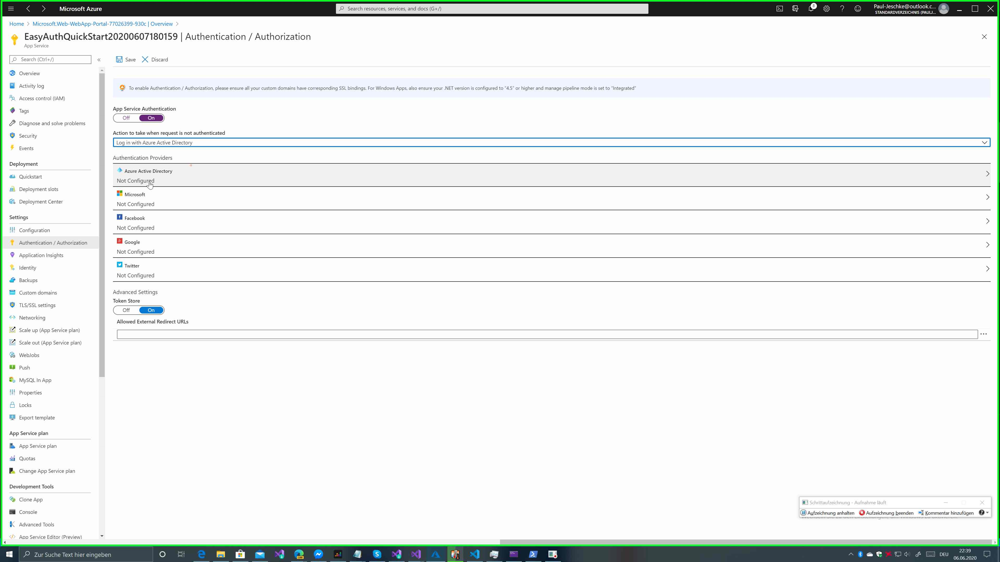
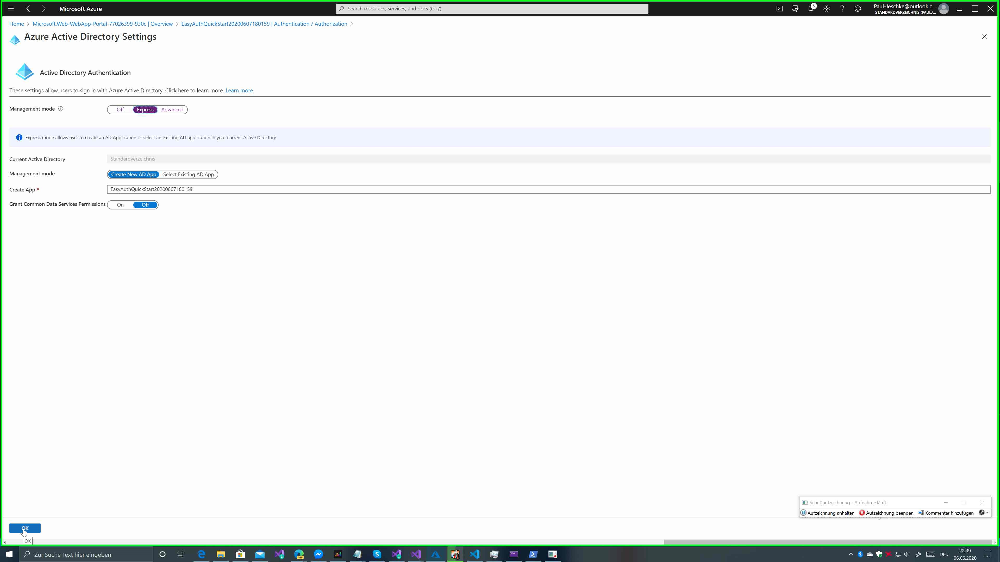

# KK.AspNetCore.EasyAuthAuthentication

This helps getting azure appservice authentication working with asp.net core.

## NuGet

The EasyAuth handler is provided as a nuget package and can be found on nuget.org.

| Name                                 | Status                                                                                                                                                          |
| ------------------------------------ | --------------------------------------------------------------------------------------------------------------------------------------------------------------- |
| KK.AspNetCore.EasyAuthAuthentication | [](https://www.nuget.org/packages/KK.AspNetCore.EasyAuthAuthentication/) |

You can add the package for example with the following `dotnet` command:

```bash
dotnet add package KK.AspNetCore.EasyAuthAuthentication
```

Pre-releases of this Package are pushed to an internal <a href="https://dev.azure.com/kirkone/KK.AspNetCore.EasyAuthAuthentication/_packaging?_a=feed&feed=KK.AspNetCore.EasyAuthAuthentication" target="_blank">feed an Azure DevOps</a>.

There are also access to packages from pull requests in another <a href="https://dev.azure.com/kirkone/KK.AspNetCore.EasyAuthAuthentication/_packaging?_a=feed&feed=KK.AspNetCore.EasyAuthAuthentication-PR" target="_blank">Azure DevOps feed</a>. All Packages in this feed has a name like this: `PR-{pull request number}-KK.AspNetCore.EasyAuthAuthentication`. So you must only pick the package of your PR to check your changes in a test project. All changes of the pull request are tracked in the pull request package version history.

## Build

The build environment for this project is on Azure DevOps and can be found here [dev.azure.com/kirkone/KK.AspNetCore.EasyAuthAuthentication](https://dev.azure.com/kirkone/KK.AspNetCore.EasyAuthAuthentication/_build).

### Nuget package build

| Name                                    | Status                                                                                                                                                                                                                                             |
| --------------------------------------- | -------------------------------------------------------------------------------------------------------------------------------------------------------------------------------------------------------------------------------------------------- |
| KK.AspNetCore.EasyAuthAuthentication-CI | [](https://dev.azure.com/kirkone/KK.AspNetCore.EasyAuthAuthentication/_build/latest?definitionId=24) |
| Alpha                                   | [](https://dev.azure.com/kirkone/KK.AspNetCore.EasyAuthAuthentication/_releases2?definitionId=1&_a=releases)                       |
| Beta                                    | [](https://dev.azure.com/kirkone/KK.AspNetCore.EasyAuthAuthentication/_releases2?definitionId=1&_a=releases)                        |
| Release                                 | [](https://dev.azure.com/kirkone/KK.AspNetCore.EasyAuthAuthentication/_releases2?definitionId=1&_a=releases)                     |

## Quickstart

In your Startup of your WebApp you must configure your authentication schemes and add easy auth to you dependency injection. The easiest way is to use the configuration of your web app. This can be done in the `ConfigureServices` method in your `Startup`.

```csharp
services.AddAuthentication(
    options =>
    {
        options.DefaultAuthenticateScheme = EasyAuthAuthenticationDefaults.AuthenticationScheme;
        options.DefaultChallengeScheme = EasyAuthAuthenticationDefaults.AuthenticationScheme;
    }
).AddEasyAuth(this.Configuration);
```

The next you must add the easy auth middleware to the ASP.NET pipeline. This can be enabled by the folling section in your `Configure`method in the `Startup`:

```csharp
app.UseAuthentication();
```

> Warning: make sure you add the `UseAuthentication` in the right order for your use case.

The last thing is to add the following section in the `appsettings.json` to enabled the basic providers:

```json
"easyAuthOptions": {
  "providerOptions": [
      {
        "ProviderName": "EasyAuthForAuthorizationTokenService",
        "Enabled": true
      },
      {
        "ProviderName": "EasyAuthAzureAdService",
        "Enabled": true
      }
  ]
}
```

After this you can use your app can translate the claims of easy auth for azure AD by it's own.

### Configure Azure App Service

In general you need a windows based App Service Plan to get this working. There is no Easy Auth implementation in the linux based app service plans!

> Information: for current documentation about this azure feature see [here](https://docs.microsoft.com/en-us/azure/app-service/overview-authentication-authorization).

The first step is enable the authentication feature in azure. It is important to disabled anonymous requests!



Then you need the connection to your azure active directory. (other providers currently not implemented)



Save all and publish your app. This allows you to use the user claim in you app like:

```csharp
[Authorize]
public string UserName()
{
    _ = User.HasClaim(ClaimTypes.Name, "user@somecloud.onmicrosoft.com");
    _ = User.HasClaim(ClaimTypes.Role, "SystemAdmin");
    _ = HttpContext.User.IsInRole("SystemAdmin");
    _ = User.IsInRole("SystemAdmin");
    return HttpContext.User.Identity.Name;
}
```

### Local Debugging

> Information: for this step it is required to have an configured app service!

This library give you an easy way to do local debugging enabled while your app is 100% cloud native. To do this you must only do a request to the following azure url:

`https://yourAzureAppServiceUrl/.auth/me`

The result of the request is a json with the authentication information of your current user. Put this json simply in the file `wwwroot/.auth/me.json`, and you are these user in your next debugging session. You also don't need a connection to the internet.

> Important: You must enable `UseStaticFiles` in your `Startup`. This is the case in the default ASP.NET frontend project.

## Details of the implementation

### Adding custom roles

If you want to add roles to the `User` property you can have a look in `Transformers/ClaimsTransformer.cs` in the Sample project. There you can see an example how to get started with this.

### Configure options via configuration (recommended)

You can use the default behavior of asp.net core to configure EasyAuth. You must only change in your `Startup.cs` the `.AddEasyAuth()` to `.AddEasyAuth(this.Configuration)`.

> To get the property `this.Configuration` in your `Startup.cs` you must add `IConfiguration configuration` to your constructor parameters and create a property.

To configure you providers you simple add the following to your `appsettings.json`. (or to your environment variables, or other [configuration sources](https://docs.microsoft.com/en-us/aspnet/core/fundamentals/configuration/).)

```json
"easyAuthOptions": {
    "AuthEndpoint": ".auth/me",
    "providerOptions": [
      {
        "ProviderName": "EasyAuthForAuthorizationTokenService",
        "Enabled": true,
        "NameClaimType": "http://schemas.xmlsoap.org/ws/2005/05/identity/claims/spn", // optional
        "RoleClaimType": "roles" // optional
      },
      {
        "ProviderName": "EasyAuthAzureAdService",
        "Enabled": true,
        "NameClaimType": "http://schemas.xmlsoap.org/ws/2005/05/identity/claims/emailaddress", //optional
        "RoleClaimType": "http://schemas.microsoft.com/ws/2008/06/identity/claims/role" //optional
      }
    ]
  }
```

Here are some notes to the JSON above:

-   each provider is disabled by default so you must enabled it
-   you can create own providers but there must implement `IEasyAuthAuthentificationService`. But you must also activate them here. (Don't put them in the DI. This package will do this by it's own.)
-   The `ProviderName` is the class name of the provider. that must be unique in your application.
-   The xClaimType property only define the property in the token that provide the required information. Internally that will always mapped to **name** and **role** claims.

> A list of all providers can be found in the headline `Auth Provider`

### Configure options via code (not recommended)

#### Custom options

You can provide additional options for the middleware:

```csharp
).AddEasyAuth(
   options => {
      // Add the EasyAuthForApplicationService auth provider and enabled it. Also Change the NameClaimType
      options.AddProviderOptions(new ProviderOptions("EasyAuthForApplicationsService"){Enabled = true, NameClaimType = "Test"})
   }
);
```

The `NameClaimType` is the ClaimType of the value which one will be used to fill the `User.Identity.Name` field.

#### Local Debugging advance

For debugging your application you can place a `me.json` in the `wwwroot/.auth` folder of your web app and add some configuration to the `AddEasyAuth` call.
For example:

```json
"localProviderOption": {
   "AuthEndpoint": ".auth/me.json",
   "NameClaimType": "http://schemas.xmlsoap.org/ws/2005/05/identity/claims/emailaddress",
   "RoleClaimType": "http://schemas.microsoft.com/ws/2008/06/identity/claims/role"
}
```

This provider automatically deactivate it self in azure, to avoid anonymous access!

> **Info**: You can obtain the content for this file from an Azure Web App with EasyAuth configured by requesting the `/.auth/me` endpoint.

> **Info**: Make sure you added static file handling to your pipeline by adding `app.UseStaticFiles();` to your `public void Configure` method in the `Startup.cs`, e.g. just after `app.UseHttpsRedirection();` entry. Otherwise the static file can not be found at runtime.

> **Info**: Using a `wwwroot` sub-folder name that starts with `'.'`, like the suggested `.auth` folder name, is useful for content relevant only for localhost debugging as these are treated as hidden folders and are not included in publish output.

## Auth Provider

There are some predefined providers in this package. If you need your own or want contribute to our existing providers you must implement the `IEasyAuthAuthentificationService`.

All providers can be configured with the following section in the `appsettings.json`

```json
"easyAuthOptions": {
    "providerOptions": [
      {
        "ProviderName": "EasyAuthForAuthorizationTokenService", // type name of the provider
        "Enabled": true,
        "NameClaimType": "http://schemas.xmlsoap.org/ws/2005/05/identity/claims/spn", // optional
        "RoleClaimType": "roles" // optional
      },
      {
        "ProviderName": "EasyAuthForAuthorizationTokenService",
        "Enabled": true
      },
      {
        "ProviderName": "EasyAuthAzureAdService",
        "Enabled": true
      },
      {
        "ProviderName": "EasyAuthMicrosoftService",
        "Enabled": true
      },
      {
        "ProviderName": "EasyAuthFacebookService",
        "Enabled": true
      },
      {
        "ProviderName": "EasyAuthTwitterService",
        "Enabled": true
      },
      {
        "ProviderName": "EasyAuthGoogleService",
        "Enabled": true
      }
    ],
    // the following is optional
    "localProviderOption": {
      "AuthEndpoint": ".auth/me.json",
      "NameClaimType": "http://schemas.xmlsoap.org/ws/2005/05/identity/claims/emailaddress",
      "RoleClaimType": "http://schemas.microsoft.com/ws/2008/06/identity/claims/role"
    }
  }
```

### `LocalAuthMeService`

This is a slightly special provider. It does **not** implement the 'IEasyAuthAuthentificationService'. This provider is for development only!
It automatic disable it self, if you has configured azure easy auth feature.
A developer can create a JSON with the content of the `/.auth/me` endpoint of an EasyAuth protected Azure Web App. So you don't need a connection to the internet or azure for development and just use your local things.
You must only configure an Azure Web App with Authentication and browse the path:

`https://hostnameOfYourWebSite/.auth/me`

This endpoint returns a json after the authentication. Put the content in a new file in your `wwwroot` folder. (for example create a path like in the `wwwroot` folder: `.auth/me.json`)

If you must customize the settings of that provider you can add the section `localProviderOption` to your `appsettings.json`:

```json
"localProviderOption": {
   "AuthEndpoint": ".auth/me",
   "NameClaimType": "http://schemas.xmlsoap.org/ws/2005/05/identity/claims/emailaddress",
   "RoleClaimType": "http://schemas.microsoft.com/ws/2008/06/identity/claims/role"
}
```

### `EasyAuthForAuthorizationTokenService`

Use this provider if you have a Azure Web App, that is not only be used by humans. For instance if you want to access your app with a Service Principal (SPN).

To create a Service Principal (SPN), which get access to your EasyAuth protected Application. You have to change the app manifest for you application in your Azure AD. Thanks to [Suzuko123](https://github.com/Suzuko123) for the following sample:

```json
"appRoles": [
	{
	    "allowedMemberTypes": [
			"Application"
		],
	    "description": "allow a call as system admin.",
		"displayName": "SystemAdmin",
		"id": "dd6d2784-5fa1-4c97-9f9b-8376a85b4163",
		"isEnabled": true,
		"lang": null,
		"origin": "Application",
		"value": "SystemAdmin"
	}
]
```

This will allow a spn to get the role `SystemAdmin` in your protected application. The default `User.Identity.Name` of an SPN is the SPN Guid.

### `EasyAuthAzureAdService`

This is the most common auth provider. You can use it to work with Azure Active Directory Users in your easy auth application.

### EasyAuthMicrosoftService

If your users only has personal accounts because your app isn't a bushiness application, use this provider.

### EasyAuthFacebookService

If your users are primary come from facebook use this provider.

### EasyAuthTwitterService

If your users are primary come from twitter use this provider.

### EasyAuthGoogleService

If your users are primary come from twitter use this provider.

## Authors

-   **Kirsten Kluge** - _Initial work_ - [kirkone](https://github.com/kirkone)
-   **paule96** - _Refactoring / implementing the new stuff_ - [paule96](https://github.com/paule96)
-   **Christoph Sonntag** - _Made things even more uber_ - [Compufreak345](https://github.com/Compufreak345)
-   **myusrn** - _Dropped some knowledge about making IsInRoles work_ - [myusrn](https://github.com/myusrn)
-   **Suzuko123** - _Dropped some knowledge about Service Principals with easy auth_ - [Suzuko123](https://github.com/Suzuko123)
- **MaximRouiller** - _Dropped the idea to check if the app service is configured right. .[MaximRouiller](https://github.com/MaximRouiller)

See also the list of [contributors](https://github.com/kirkone/KK.AspNetCore.EasyAuthAuthentication/graphs/contributors) who participated in this project.

## License

This project is licensed under the MIT License - see the [LICENSE.md](LICENSE.md) file for details.

## Acknowledgments

-   Inspired by this [StackOverflow post](https://stackoverflow.com/a/42402163/6526640) and this [GitHub](https://github.com/lpunderscore/azureappservice-authentication-middleware) repo
